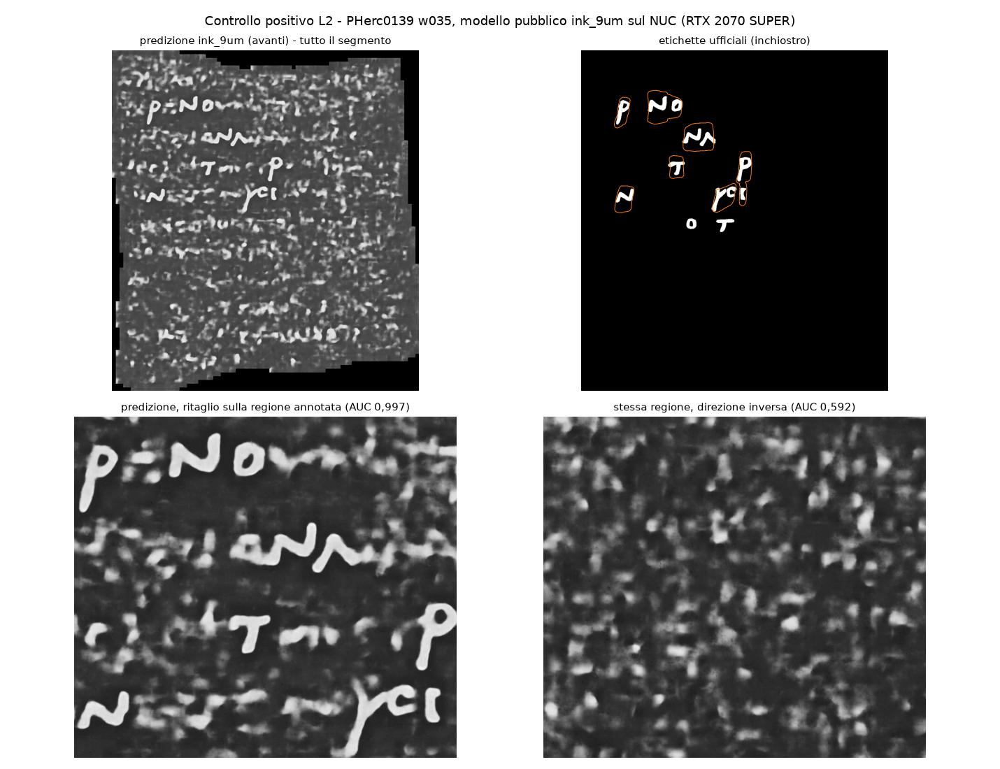
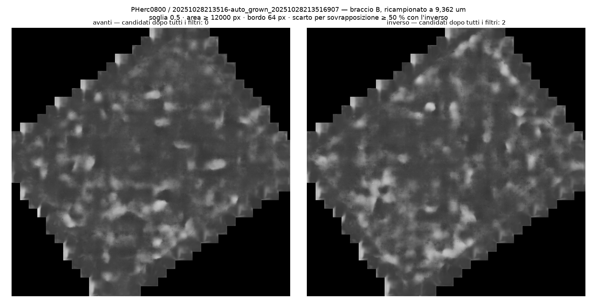
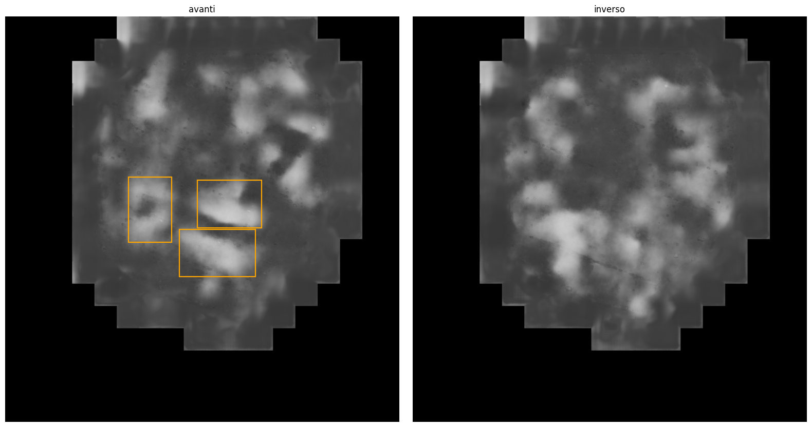

# September write-up: a First Letters null, how it was made, and what failed

This page is the long form of the [README](README.md). It is for someone who wants to redo the
run, or reuse the parts that failed so they don't have to rediscover them.

## What ran, and on what

The model is the public cross-scroll `ink_9um` checkpoint, `hybrid_3d2d-seed43/step-060000`
(sha256 in `PREREGISTRATION.md`), unchanged. It read:

- **PHerc. 0800**: every published segment, six of them, from volume `20250521135224`. That
  volume is on the First Letters list as updated on 24 September. Each segment was read twice:
  at the native 8.64 µm, and resampled to 9.362 µm, a training scale.
- **PHerc. MANBp**: nine wraps that have meshes but no published surface volumes. They were
  rendered here at 9.596 µm, 34.0 cm² in total. MANBp is not on the First Letters list.

Both depth orders were read. Ink should appear in the forward panel and not in the reverse one.

## The control, before any target



On PHerc. 0139 w035, a training segment with published labels, the same pipeline gives AUC
0.997 on the labelled pixels and 0.592 in reverse. The gate, fixed before any target, was
0.85. This shows the pipeline works end to end. It says nothing about how well it reads a
scroll it was not trained on.

## The targets





There are twelve PHerc. 0800 panels (six segments, two scales) and nine for MANBp, all in the
repo. None shows stroke-like structure in the forward panel that the reverse lacks. w8, the
smallest MANBp wrap, is the least clear-cut: the reader with no context called it "nothing"
with high confidence, the other with medium confidence.

## Commands, as run

PHerc. 0800, on a Windows mini-PC with an RTX 2070 SUPER (one segment shown; the rest differ
only in the path):

```
python -m vesuvius.ink_detection.inference.infer <segment>/volume-9362.zarr \
  checkpoints/ink_9um/hybrid_3d2d-seed43/step-060000.pth <segment>/predB-9362.tif \
  --overlap 0.5 --blend-mode hann --direction both --batch-size 32 --no-compile
```

PHerc. MANBp, on an Apple Silicon Mac, with `vc_render_tifxyz` built from villa `main`
at `d285029ab` (the same build as the L1 replication) and, for inference, villa's `vesuvius`
package with [villa#1865](https://github.com/ScrollPrize/villa/pull/1865)'s one change, so that it runs on the Mac GPU:

```
vc_render_tifxyz --volume <cache> \
  --remote-url s3://vesuvius-challenge-open-data/PHercMANBp/volumes/20251216152116-2.399um-0.2m-78keV-masked.zarr/ \
  --segmentation <wrap mesh> --zarr-output <wrap>.zarr \
  --scale 1 --group-idx 2 --num-slices 31 --slice-step 1 --flip-normals --cache-gb 2
python -m vesuvius.ink_detection.inference.infer <wrap>.zarr <checkpoint> <wrap>-pred.tif \
  --overlap 0.5 --blend-mode hann --direction both --batch-size 8 --no-compile
```

The full PHerc. 0800 commands, with every path, are in each segment's `rapporto.json`; the
MANBp commands are the two above, run once per wrap by `manbp/run.sh`. Which builds were used,
with hashes, is in `PREREGISTRATION.md`, «What was run». One deviation is declared there: the
Mac ran at `--batch-size 8`, not the 32 frozen on the NUC; on the gate the two give AUC 0.997211
and 0.997213.
`python3 reproduce.py` recomputes every number in the README from those raw files.

## What failed, with numbers

The aim was an automatic verdict, so that a null would not rest on someone looking at
pictures. [Four criteria](README.md#four-automatic-criteria-that-failed) were tried, and each
failed:

1. **Count, forward against reverse.** On MANBp w0 the forward map is brighter overall, which
   gives 19 candidates against 0. Thresholding the reverse map at the same lit fraction gives
   19 against 21. The count was measuring brightness, not structure.
2. **Ratio.** The lettered control's forward/reverse ratio, 1.33, falls inside the blank
   targets' range, 1.18–1.38.
3. **Density.** Candidates per occupied Mpx: 3.55 and 3.39 on the two lettered segments;
   0.87 and 1.2 on PHerc. 0800; 4.59 on MANBp w0. The blank segments fall on both sides of the
   lettered ones. Which denominator is used matters, and `ERRATA.md` §4 says which one and why.
4. **Shape.** MANBp w0's blobs are more elongated than w029's real letters: slenderness 45.2
   against 35.5.

A filter that drops forward blobs overlapping reverse ones removed a real letter on w035
(overlap 0.525), so it is reported only as a diagnostic. The pipeline yields candidates, not
verdicts, and the verdict is visual.

The things that changed after looking at data are all in `PREREGISTRATION.md`, with the time
and the reason for each: the minimum blob size (15,011 → 12,000 px), PHerc. 0332 excluded
because its published transform cannot be trusted, and MANBp's surface reported as the
34.0 cm² actually present, not the 49.0 cm² the `meta.json` files declare. What went wrong is
in `ERRATA.md`. One example is the first blind reading of the PHerc. 0800 panels, which was not
blind on one panel.

## Who looked

MANBp's nine panels were shuffled with two lettered controls and unlabelled. Two AI readers
judged them: one with no context, and the agent that made them, which published a hash of its
verdicts before reading the other's. Both called both controls "letters" and all nine wraps
"nothing".

## Costs

PHerc. 0800: 174 s of network and 491 s of GPU. PHerc. MANBp: 34 minutes on the Mac, render
included. No cloud or rented GPU was used; both machines were already owned.

## Limits

This null is for the public `ink_9um` checkpoint, at these scales, on these segments. It is
not a claim that either scroll has no ink. On 24 September the Challenge announced a new 9 µm
recipe that finds letters on PHerc. 1447; its model was not public when this was written.

AI-assisted (Claude Code), human-directed.
